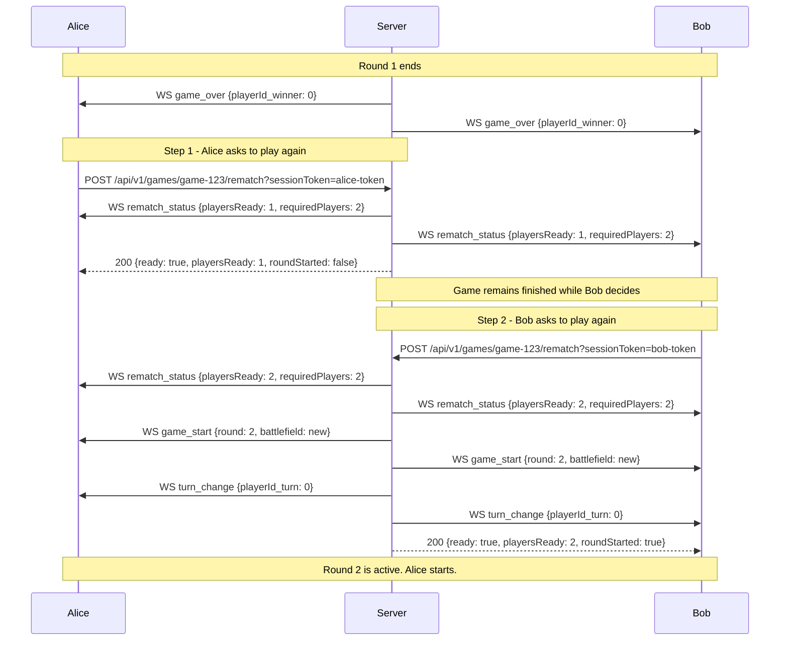
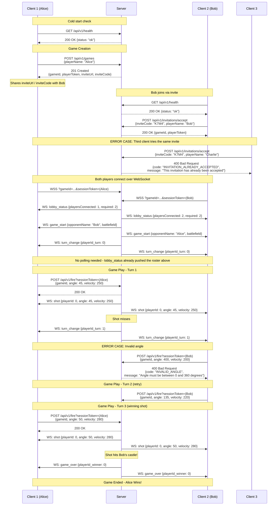

# API Documentation

> Canonical machine-readable API contract source is maintained in `contracts/openapi/superartillery.yaml`.
> This document is explanatory and should stay aligned with the contract source.

## Communication Protocol

This document describes the REST API and WebSocket communication used by the private, invite-only, in-memory-only game system.

Clients call HTTP(S) endpoints exposed by the server to start an action (create a game, accept an invitation, fire a shot).

Once both players are connected, the server pushes WebSocket messages to keep clients in sync with game state changes (shots, turn changes, game over).

There is no persistence: games, invitations, and sessions live only in server memory and are lost on restart.

---

## REST API Endpoints (HTTP/HTTPS)

### Health Check

Used by the client to detect a sleeping/cold-starting server before create/accept operations, with retry logic (delays such as 0, 1, 2, 5 seconds).

**GET** `/api/v1/health`

**Response `200`:**
```json
{
  "status": "ok" | "degraded",
  "timestamp": "2026-08-31T12:00:00.000Z",
  "gameCount": 3,
  ...
  "version": "1.0.1"
}
```

### Create a Private Game
```

---

    "inviteUrl": "https://example.com/SuperArtillery/?server=https%3A%2F%2Fapi.example.com&invite=K7M4",

Creates a new private, two-player game in memory and returns tokens/links for the initiator to share.

  ```

  ---

  Creates a new private, two-player game in memory. The client URL preserves the deployed application path in the generated invitation link.

  **POST** `/api/v1/games`

  **Payload:**
  ```json
  { "name": "Alice", "clientUrl": "https://example.com/SuperArtillery/" }
  ```

  **Response `201`:**
  ```json
  {
    "gameId": "opaque-game-id",
    "playerToken": "opaque-session-token",
    "inviteUrl": "https://example.com/SuperArtillery/?server=https%3A%2F%2Fapi.example.com&invite=K7M4",
    "inviteCode": "K7M4"
  }
  ```

  **Errors:**
  - `400 INVALID_PLAYER_NAME` — name missing/too long/invalid first character.
  - `503 MAX_GAMES_REACHED` — server at maximum concurrent-game capacity.

  ---

  ### Accept an Invitation

  Accepts a private game invitation via the short 4-character code from the link or display. One-time use only.

  **POST** `/api/v1/invitations/accept`

  **Payload:**
  ```json
  { "inviteCode": "K7M4", "name": "Bob" }
  ```

**Errors:**
- `400 INVALID_PLAYER_NAME` — invalid display name.
- `400 MISSING_INVITE` — no invite code supplied.
- `400 INVALID_INVITATION` — unknown invite code.
- `400 INVITATION_ALREADY_ACCEPTED` — invitation was already used by another player (e.g. a third client trying to join a game that already has two players).
- `400 GAME_UNAVAILABLE` — game exists but is no longer pending.
---
### Get Game Status

Fetches a one-time snapshot of non-sensitive lobby state. Requires a valid session token. Clients only need this for the very first render (e.g. on reconnect) — while a game is pending, the server pushes `lobby_status` over WebSocket on every roster change, so **polling this endpoint is no longer necessary**.

**GET** `/api/v1/games/{gameId}/status?sessionToken=...`

**Response `200`:**
```json
{
  "status": "pending" | "active" | "finished" | "expired",
  "playersConnected": 1,
  "required": 2
}
```

### Fire Action
Fires a shot for the current player's turn. Player identity is derived server-side from the session token — the client never supplies a `playerId`. On success, the server broadcasts `shot` to both players over WebSocket, followed by either `turn_change` or `game_over`.

**POST** `/api/v1/fire?sessionToken=...`

**Payload:**
```json
{ "gameId": "opaque-game-id", "angle": 45, "velocity": 250 }
```

**Response:** `200` (no body)

- `404 GAME_NOT_FOUND`
- `401 INVALID_SESSION_TOKEN`
- `GAME_NOT_ACTIVE` — game hasn't started or has ended.
- `NOT_YOUR_TURN`
- `INVALID_ANGLE` — must be between 0 and 360 degrees.
- `INVALID_VELOCITY` — must be positive.

---

## WebSocket Authentication

Clients open an authenticated WebSocket connection using the `gameId` and `playerToken` (session token) returned by `/games` or `/invitations/accept`:

```text
wss://server/?gameId=opaque-game-id&sessionToken=opaque-session-token
```

The server derives player identity from the session token; it never trusts a client-supplied `playerId`. The game starts automatically once both players' sockets are connected.

---

## WebSocket Messages (Server → Client)

#### Game Start
Sent to both players once both WebSocket connections are open.
```json
{
  "type": "game_start",
  "gameId": "opaque-game-id",
  "opponentName": "Bob",
  "battlefield": { "...": "battlefield config (gravity, castles, etc.)" }
}
```

#### Lobby Status
Broadcast to every connected socket whenever the lobby roster changes (a player connects, disconnects, or the lobby expires) while the game is still `pending`. Replaces the need to poll `GET /games/{gameId}/status`.
```json
{
  "type": "lobby_status",
  "status": "pending",
  "playersConnected": 1,
  "required": 2,
  "slots": [
    { "playerId": 0, "name": "Alice", "status": "ready" },
    { "playerId": 1, "status": "waiting" }
  ]
}
```

#### Shots Fired
Broadcast to both players after a successful `POST /api/v1/fire`.
```json
  "type": "shot",
  "playerId": 0,
  "angle": 45,
  "velocity": 250
}
```

#### Turn Change
Sent when a shot misses.
```json
{ "type": "turn_change", "playerId_turn": 1 }
```

#### Game Over
Sent when a shot hits the opponent's castle.
```json
{ "type": "game_over", "playerId_winner": 0 }
```

#### Rematch Status
Broadcast to both players whenever one of them requests another round.
```json
{
  "type": "rematch_status",
  "playersReady": 1,
  "requiredPlayers": 2
}
```

### Request a Rematch

After `game_over`, either player can request another round. The request is authenticated with the player's session token:

**POST** `/api/v1/games/{gameId}/rematch?sessionToken=...`

**Response `200`:**
```json
{
  "ready": true,
  "playersReady": 1,
  "requiredPlayers": 2,
  "roundStarted": false
}
```

The first request waits for the other player. When both players have requested a rematch, the second response has `roundStarted: true`; the server resets readiness, creates a new battlefield, increments the round, and sends `game_start` followed by `turn_change` to both WebSocket clients.

**Errors:**
- `400 REMATCH_NOT_AVAILABLE` - the game has not finished yet.
- `401 INVALID_SESSION_TOKEN` - the session token is missing or does not belong to the game.
- `404 GAME_NOT_FOUND` - the game does not exist.

### Rematch Example: Step by Step

This example assumes Alice (`playerId: 0`) won round 1 and both players keep their existing WebSocket connections open.



After the second request starts the new round, `GET /api/v1/games/{gameId}/status` reports `status: "active"`, `rematchPlayersReady: 0`, and each player's `rematchReady: false`.

---

## Sample Game Flow Diagram



### Key Points Illustrated
- **Cold start**: both clients call `GET /api/v1/health` before their first game action.
- **Private invitation**: only the game creator's shared link/code lets another player join — there is no open registration.
- **One-time invitations**: a third client attempting to reuse an already-accepted invite gets `400 INVITATION_ALREADY_ACCEPTED`, since a private game only ever admits two players.
- **Session-token identity**: `playerId` is never supplied by the client — it's derived from the session token on both HTTP and WebSocket requests.
- **Turn-based gameplay**: players alternate firing; invalid input (e.g. out-of-range angle) is rejected with a descriptive error and does not consume the turn.
- **Game conclusion**: a hit broadcasts `game_over` to both clients with the winner's player ID.

